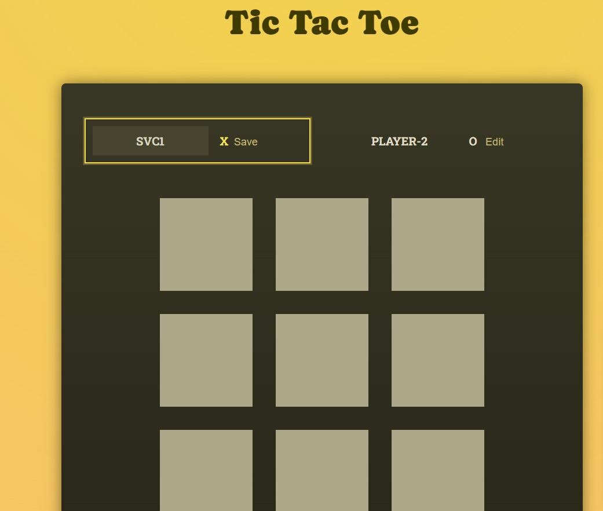

# React Tic Tac Toe Game

A simple Tic Tac Toe game built using React. This game allows two players to compete against each other. The game board is displayed on the screen, and players can take turns clicking on the cells to place their marks (X or O). The first player to get three of their marks in a row (horizontally, vertically, or diagonally) wins the game.


You can play the live demo of the game (https://tic-tac-toe-two-pink.vercel.app/)


## Features

- Two-player mode (Player X and Player O)
- Interactive UI with real-time updates
- Highlights the winning combination
- Restart button to start a new game

## Installation

To get a local copy of this project up and running, follow these simple steps:

1. **Clone the repository**:
    ```bash
    git clone https://github.com/riyazpt/Tic-Tac-Toe.git
    ```
2. **Navigate to the project directory**:
    ```bash
    cd react-tic-tac-toe
    ```
3. **Install the dependencies**:
    ```bash
    npm install
    ```
   
